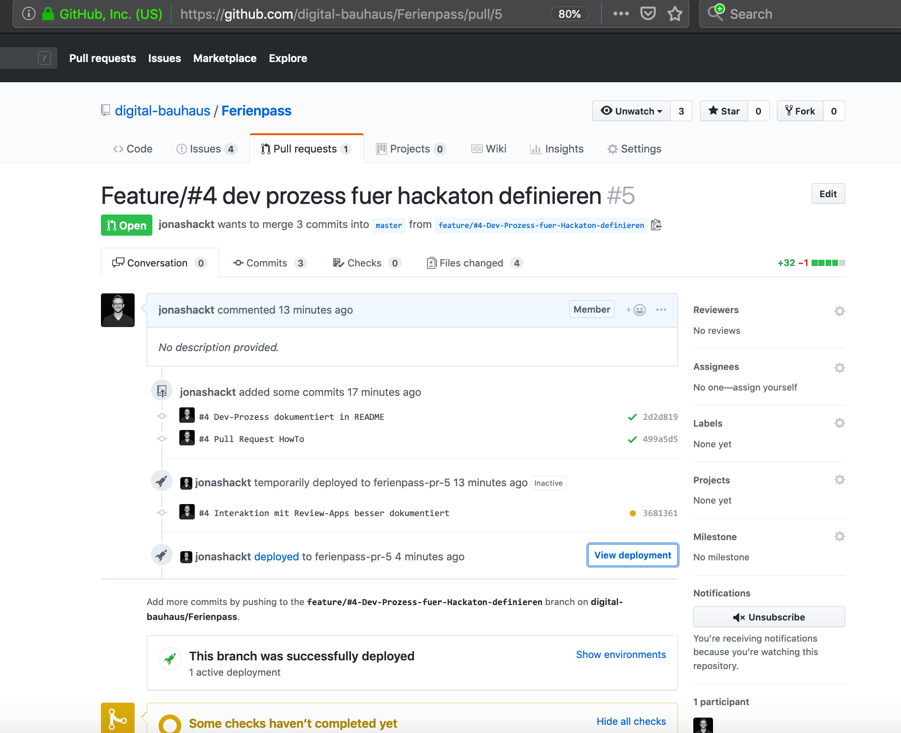

# Ferienpass

[](https://travis-ci.org/digital-bauhaus/Ferienpass)
[](https://coveralls.io/github/digital-bauhaus/Ferienpass?branch=master)
[](https://github.com/digital-bauhaus/Ferienpass-Anmeldung/blob/master/LICENSE)

## Historie

Dieses Projekt führt im Rahmen eines Hackatons die Ergebnisse eines Studentenprojekts weiter. Das Projekt fand innerhalb eines Projektseminars an der [Bauhaus-Universität Weimar](https://www.uni-weimar.de/de/medien/professuren/intelligente-softwaresysteme/) von 2017-10 bis 2018-04 statt. Das Ziel war die Digitalisierung des Anmeldeprozesses für Kinder der Stadt Weimar in Thüringen für Sommerferien-Aktivitäten im Rahmen des gemeinnützigen [Ferienpass-Projektes](http://www.ferienpass-weimar.de/).

> Über das Projekt wurde mehrfach berichtet: Lokale Presse [Thüringer Allgemeine 2018-01-17](http://www.thueringer-allgemeine.de/web/zgt/suche/detail/-/specific/Lange-Schlange-im-Kinderbuero-war-der-Ausloeser-168601916) & [Thüringische Landeszeitung 2018-01-17](http://weimar.tlz.de/web/weimar/startseite/detail/-/specific/Lange-Schlange-im-Kinderbuero-war-der-Ausloeser-168601916) & [BAUHAUS.JOURNAL ONLINE 2018-01-16](https://www.uni-weimar.de/de/universitaet/aktuell/bauhausjournal-online/titel/projektpraesentation-medieninformatik-studierende-entwickeln-online-anmeldung-fuer-weimarer-ferienpas-1/) & [Focus Online](https://www.focus.de/regional/thueringen/bauhaus-universitaet-weimar-meldung-vom-16-01-2018_id_8309726.html) & [codecentric.de](https://www.codecentric.de/2018/01/17/schoenere-ferien-dank-digitalisierung/) & [final celebration, Focus Online](https://www.focus.de/regional/thueringen/stadt-weimar-dank-an-die-foerderer-des-ferienpass-weimar-2018_id_9230231.html)

Die Ergebnisse des Projektes sind in den folgenden zwei Microservices abgebildet:

https://github.com/digital-bauhaus/Ferienpass-Anmeldung

https://github.com/digital-bauhaus/Ferienpass-Admin


Das vorliegende Projekt möchte die Ergebnisse des Studenten-Projektes, dass in einer Alpha-Phase 2018 getestet wurde, nun produktionsreif machen und in 2019 den Kindern zur Verfügung stellen.


## Nutzung

Die Anmeldungsseite steht direkt auf der Startseite zur Verfügung (lokal http://localhost:8088/) , die Administrationsfunktionen liegen tiefer und finden sich ab http://localhost:8088/login

#### Login

Der Login unter https://ferienpass.herokuapp.com/login ist nun abgesichert - die Credentials werden lokal über die [application.properties](backend/src/main/resources/application.properties) konfiguriert, im PR bzw. Produktivdeployment über Umgebungsvariablen in Heroku: 

```
# application.properties
spring.security.user.name=test
spring.security.user.password=foo

# Heroku Environment Variables
SPRING_SECURITY_USER_NAME=xyz
SPRING_SECURITY_USER_PASSWORD=xyz
```

#### Bestätigungsmails

Die Mails für die erfolgreiche Anmeldung werden nun mit Hilfe des [Heroku-Addons Sendgrid](https://elements.heroku.com/addons/sendgrid) verschickt. Im genutzten Free-Tier sind 12.000 freie Mails inbegriffen pro Monat.

Der Test dafür benötigt lokal eine manuell zu setzende Umgebungsvariable `SENDGRID_API_KEY=korrekterKey` mit dem korrekten Key (den Key am besten aus der Heroku-Configvar beziehen!) - z.B. innerhalb der Run Configurations der IDE.

Innerhalb von TravisCI wird auch die Environment Variable benötigt. 

Der Inhalt der Mail wird über die Datei [mailtext.txt](backend/src/main/resources/mail/mailtext.txt) beschrieben.


# Contribute

## Aufbau

Die bisherige Microservice-Struktur wird zugunsten einer vereinfachten Weiterentwicklung und Wartung aufgegeben und in einen Mini-Monolithen bzw. Microlithen überführt.


    +-------------------+   +--------------------+
    |                   |   |                    |
    |                   |   |                    |
    |                   |   |                    |
    |     Anmeldung     |   |     Verwaltung     |
    |     (Vue.js)      |   |      (Vue.js)      |
    |                   |   |                    |
    |                   |   |                    |
    +-------------------+   +--------------------+
              |                       |
    +---------v-----------------------v----------+
    |                                            |
    |                                            |
    |                                            |
    |      Spring Boot Backend (REST API)        |
    |                                            |
    |                                            |
    |                                            |
    +--------------------------------------------+
                          |
                          v
            +---------------------------+
            |                           |
            |    Postgres-DB            |
            |    (lokal H2 in-memory)   |
            |                           |
            +---------------------------+

## Prerequisites

* Java
* NPM (optional)

MacOS

```console
> brew cask install java
> brew install npm
```

Windows

```console
> choco install jdk
> choco install npm
```

Linux

```console
> apt-get install jdk
> apt-get install npm
```

### Local Setup

Wir nutzen den [maven-wrapper](https://github.com/takari/maven-wrapper).
Dadurch wird keine eigene Maven-Installation benötigt.

Unter Linux und Mac kann der maven-wrapper so eingesetzt werden
```
./mvnw <maven command here>
```

Unter Windows erfolgt der Aufruf mit
```
mvnw.cmd <maven command here>
```

Im folgenden gehen wir immer von Aufrufen unter Linux aus.

#### build project

```console
> .mvnw clean install
```

#### run project

```console
> .mvnw --projects backend spring-boot:run
```

check following links

`http://localhost:8088/#/`

`http://localhost:8088/#/Veranstaltungen/`

`http://localhost:8088/swagger-ui.html`

### Continuous Integration and Deployment

Tests werden automatisch bei jedem Push auf den Feature-Branches oder den master durch [TravisCI](https://travis-ci.org/digital-bauhaus/Ferienpass) ausgeführt und es finded ein automatischer Deploy auf Heroku statt, wenn der TravisCI build erfolgreich durchgelaufen ist.

Entwickelt werden soll mit Hilfe von Feature-Branches und Pull-Requests - der master-Branch ist als "Produktions-ready" immer baufähig zu halten.
 

##### Dev-Workflow

* __Clone:__ lokal das Repository clonen per `git clone https://github.com/digital-bauhaus/Ferienpass.git`
* __No Merge Commits:__ lokal das Erstellen von Merge-Commits unterbinden mit der Einstellung: `git config --global pull.rebase preserve`
* __Focus on Issues:__ auf [GitHub ein Issue](https://github.com/digital-bauhaus/Ferienpass/issues) auswählen oder neu erstellen
* __Create Branch:__ dann einen neuen Branch erstellen nach dem Muster `feature/#issueNummer-issue-titel`, z.B. `feature/#2-kostenplichtige-anmeldung`
* lokal pullen und entwickeln 
* __Do Tests run?__ Vor dem Commit sicherstellen, dass alle Tests laufen und die Anwendung baut
* __Commit message!__ Beim Commit darauf achten, dass der Kommentar die GitHub-Issue-Nummer enthält, z.B. `#4 Neuer Button erstellt` 
* Pushen


##### Feature ready? --> Pull Request!

* __When your Feature is ready__ Pull Request auf GitHub erstellen


* __Review App:__ [Heroku](https://dashboard.heroku.com/pipelines/6d86397b-7093-4252-b978-2f57b25e5620) erstellt nun automatisch eine Review-App für diesen PullRequest/Branch (Access für die Pipeline bitte bei [jonashackt](https://github.com/jonashackt) anfragen):


* Heroku erstellt eine eigene URL für die Anwendung, unter der sie getestet werden kann. Die URL kann über `Open App in browser` über den kleinen Button neben der App geöffnet werden:


* Auf GitHub werden alle Commits, die Builds sowie die Heroku-Deployments vollständig im Pull Request dargestellt:



Wenn alles passt, kann das Featuer in den master-Branch gemergt werden per `Merge pull request`. __Danach landed der Stand automatisch auf Staging bzw. Produktion!__

* __Delete Feature-Branch:__ Direkt auf GitHub im Pull Request sollte man den Feature Branch gleich noch löschen! Dann wird auch auf Heroku die Review App wieder weggeräumt (und verursacht keine Kosten!).

* __local master FTW:__ Lokal nun wieder auf den master-Branch wechseln und das Projekt neu pullen, der alte Feature-Branch sollte nun auch lokal gelöscht sein.

##### Staging / Production

Die pre-produktive / produktive Anwendung kann unter der folgenden URL aufgerufen werden:

https://ferienpass.herokuapp.com/#/
